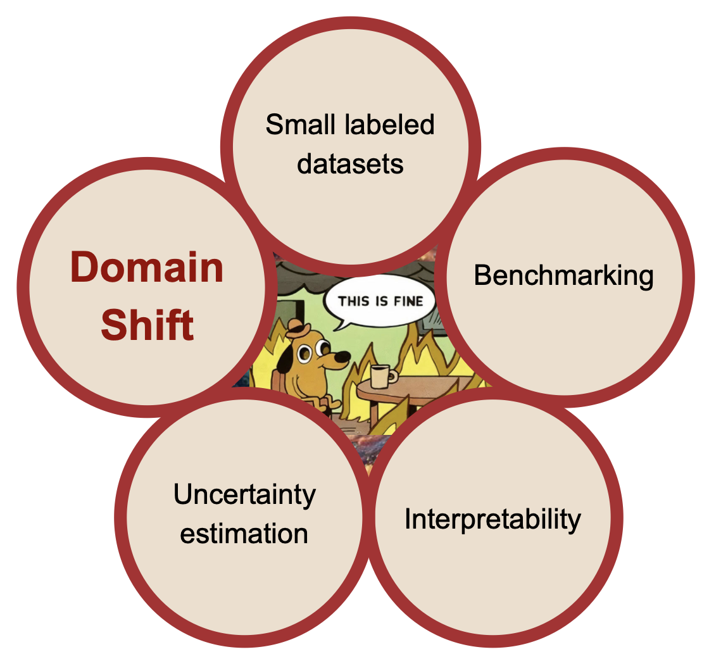

# Domain Adaptation Tutorial
These are a set of tutorials made for 2025 IMPRS Summer School, in companian with the lecture about Domain Adaptation by [Aleksandra Ciprijanovic](https://www.alexciprijanovic.com). The tutorials can be found under the `tutorials` directory, and the solutions to both can be found under `solutions.` If, by chance, you are struggling to train the models, pre-trained models can be found in `pretrained_models.zip`.

## Setup

These notebooks were able to run in $\mathcal{O}(\text{minutes})$ time on my 2021 M1 Macbook Pro. That being said, things will be faster on a GPU, but feel free to use in your local IDE if you are more comfortable that way. It just may take some more time. That is ok, there are ample things to think about while you wait.

The only package you will likely not have is `geomloss`, which we use to efficiently compute statistical distances (sinkhorn divergences, MMD). You should be able to run a simple `pip install` if you don't have it. If you have many things to install, you can do `pip install requirements_X.txt', where $X$ denotes CPU/GPU.

## Tutorials

Tutorial 1: Comparison between maximum mean discrepancy (MMD) and domain adversarial neural networks (DANNs), for generalizing between the MNIST and MNIST-M datasets. In this tutorial, you'll see firsthand how DA can improve generalization performance. 

Lecture 2: Implementing the Sinkhorn divergence and studying automated ways to omit hyperparmaeter tuning when training models with domain adaptation. This tutorial 
uses real galaxy images from the Sloan Digital Sky Survey (SDSS) and Dark Energy Spectroscopic Instrument (DESI) Legacy Imaging Surveys. These will be download from [this Zenodo link](https://zenodo.org/records/15215272). I would use Chrome to download the data (I had issues on Safari).

## Getting the most out of these

The focus is on conceptual understanding and application rather than PyTorch syntax. I've sprinkled questions and directions for further exploration throughout the notebooks; and my hope is that you can do some self-exploration and deep thinking in whatever seems interesting to you and most relevant for your own work.

## Credit
These tutorials were creadted by [Sneh Pandya](https://snehjp2.github.io) (Northeastern University).
